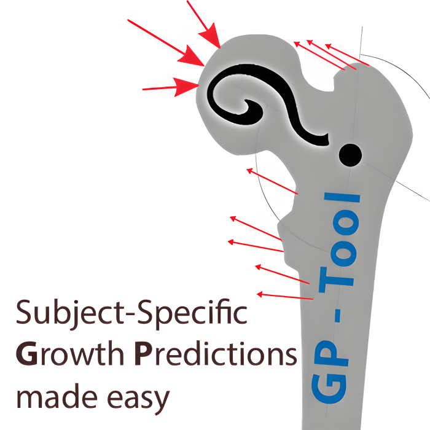
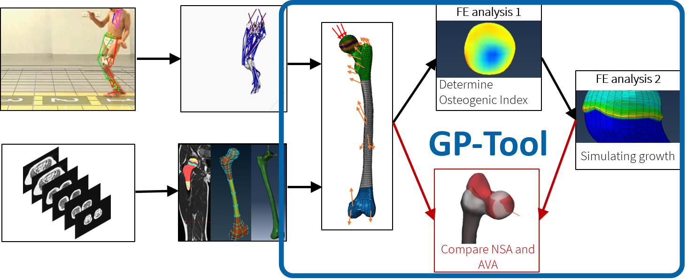
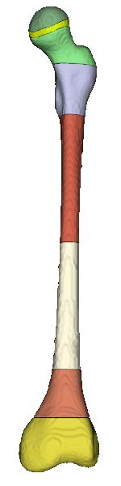
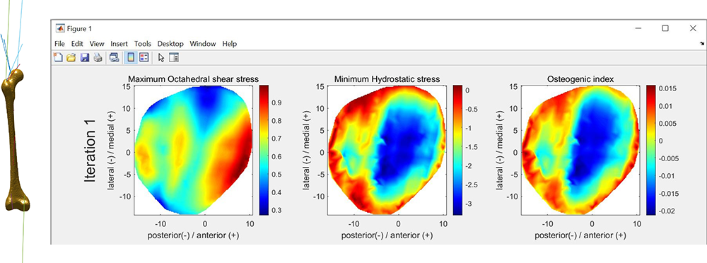

<!-- Improved compatibility of back to top link: See: https://github.com/othneildrew/Best-README-Template/pull/73 -->

<!--
*** Thanks for checking out the Best-README-Template. If you have a suggestion
*** that would make this better, please fork the repo and create a pull request
*** or simply open an issue with the tag "enhancement".
*** Don't forget to give the project a star!
*** Thanks again! Now go create something AMAZING! :D
-->

<!-- PROJECT SHIELDS -->
<!--
*** I'm using markdown "reference style" links for readability.
*** Reference links are enclosed in brackets [ ] instead of parentheses ( ).
*** See the bottom of this document for the declaration of the reference variables
*** for contributors-url, forks-url, etc. This is an optional, concise syntax you may use.
*** https://www.markdownguide.org/basic-syntax/#reference-style-links
-->

<!-- PROJECT LOGO -->
 

  

<h3 align="center">GP-Tool</h3>

  

    <b>G</b>rowth <b>P</b>rediction - Tool
     
     
    ·
    <a href="mailto:willi.koller@univie.ac.at?subject=Bugreport%20GP-Tool">Report Bug</a>
    ·
  

<!-- TABLE OF CONTENTS -->

  
Table of Contents

  <ol>
    <li>
      <a href="#about">About The Project</a>
    </li>
    <li>
      <a href="#installation">Installation</a>
    </li>
    <li>
      <a href="#generalUsage">General Usage</a>
      <ul>
        <li><a href="#generalSettings">Tab "General Settings"</a></li>
        <li><a href="#participants">Tab "Participants"</a></li>
        <li><a href="#meshes">Tab "Meshes"</a></li>
        <li><a href="#loading">Tab "Loading"</a></li>
        <li><a href="#analysis">Tab "Analysis"</a></li>
        <li><a href="#resultsAnalysis">Tab "Results of selected Analysis"</a></li>
        <li><a href="#compareAnalysis">Tab "Compare multiple Analysis"</a></li>
      </ul>
    </li>
    <li><a href="#femurSegmentation">Detailled information on femur segmentation</a></li>
    <li><a href="#quickGuide">Quick Guide on how to run an analysis</a></li>
    <li><a href="#roadmap">Roadmap</a></li>
    <li><a href="#contributing">Contributing</a></li>
    <li><a href="#license">License</a></li>
    <li><a href="#contact">Contact</a></li>
  </ol>

<!--  
 
 
 
 
 
 
 
 
  -->
<!-- ABOUT THE PROJECT -->

# <a name="about">What is the GP-Tool?</a>

 
 

<b>GP</b> is the abbreviation for <b>G</b>rowth <b>P</b>rediction
 

The GP-Tool is a toolbox which allows to perform femoral growth simulations based on a mechanobiological model ([Carriero et al., 2011](https://www.tandfonline.com/doi/abs/10.1080/10255841003682505); [Kainz et al., 2020](https://journals.plos.org/plosone/article?id=10.1371/journal.pone.0235966); [Shefelbine and Carter, 2004](https://link.springer.com/article/10.1023/B:ABME.0000012750.73170.ba); Yadav et al., [2017](https://link.springer.com/article/10.1007/s10237-017-0925-3), [2016](https://www.sciencedirect.com/science/article/pii/S0021929016303736?via%3Dihub)).

This mechanobiological model used to be challenging and very time-consuming because hexahedral elements are required within the growth plate.

The GP-Tool enables the setup of meshes from STL files easily and create finite elment models with forces from musculoskeletal simulations automatically. Femoral growth predictions can be performed with many different parameters (loading only in single directions, changes of material properties, different growth direction, ...)

The goal of this toolbox is to allow many researchers to perform the multi-scale mechanobiological model with personalized femoral geometry in an easy and comprehensive way. It also helps to improve comparability between future studies.

The GP-Tool is solely based on freely available software (for research purposes).

- General handling of the femoral geometry is done with parts of the [STAPLE-Toolbox](https://github.com/modenaxe/msk-STAPLE) - [Modenese and Renault, 2021](https://doi.org/10.1016/j.jbiomech.2020.110186)
- Base Meshing is done with [Coreform Cubit](https://coreform.com/)
- Mesh refinement is done with [MeshLab](https://www.meshlab.net/) - [Cignoni et al., 2008](http://dx.doi.org/10.2312/LocalChapterEvents/ItalChap/ItalianChapConf2008/129-136)
- Finite Element Analysis are run with [FEBio](https://febio.org/) - [Maas et al., 2012](https://doi.org/10.1115/1.4005694)
- Application built with [MATLAB App Designer](https://de.mathworks.com/products/matlab/app-designer.html)

This repository also contains **example data for one participant including MRI data and 2 different loadings** (scaled gait2392 model and personalized model with specific anteversion- and neck-shaft-angle of the participant).

(<a href="#readme-top">back to top</a>)

    

# <a name="installation">Installation</a>

Please follow these steps below carefully to avoid any problems.

1. **Install the GP-Tool by running the GP-Tool_Installer.exe**
2. Run program and select a working directory, which will contain all data from now on.
3. Make sure that you have **writing permissions on the installation folder!**
4. **Install python** (recommended version = [3.10.4 - download here](https://www.python.org/downloads/release/python-3104/))
5. **Install Coreform Cubit**: It is free (up to 50k elements) for researchers! Create an account on the [Coreform Website](https://coreform.com/) and download latest version [here](https://coreform.com/products/downloads/) - Version 2022.4 was used for testing.

   After installation run the program and be sure it is working

6. **Install FEBio**: It is free! Create an account on the [FEBio Website](https://febio.org/) and download latest version of "FEBio Studio" [here](https://febio.org/downloads/) (recommended version = 1.8)
7. **Restart the GP-Tool to be sure paths are loaded correctly**
8. **Be sure to fill in everything in the General Settings Tab**
   - Select correct Cubit Installation Path, typically "C:\Program Files\Coreform Cubit 2022.4\bin"
   - Select correct FEBio path (to exe), typically "C:\Program Files\FEBioStudio\febio\febio3.exe"
   - Click "Check all", **every lamp needs to be green!**

**Perfect, now you are ready to run some analyses** (but please continue reading to fully understand how it works)!

(<a href="#readme-top">back to top</a>)

<!-- USAGE EXAMPLES -->

# <a name="generalUsage">General Usage</a>

**Be sure that you set up everything correctly!** - see section above

The graphical user interface (GUI) is sectioned in tabs. Each tab helps to perform a specific task and groups all options for this task.
Generally, the process to perform this workflow is:

1. Select a working directory - all data will be saved and loaded from this directory. It should be empty when you start.
2. Set up a participant
3. Create a mesh for this participant
4. Create loading condition(s) for this participant from musculoskeletal simulation outputs
5. Run some analysis

**This README will now focus on each TAB seperately.**

## <a name="generalSettings">Tab "General Settings"</a>

This tab helps to set up all tools which are necessary to perform the workflow. See section [**"Installation"**](#installation) for more details.

## <a name="participants">Tab "Participants"</a>

The list on the left side contains all participants you have already set up.

To create a new participant, select "Create new".

1. Fill in some unique text as identifier (e.g. "TD01" for typicially devoloping with ID 1) - all data of this participant will be stored in a folder with this name in the working directory
2. Select the side which you want to analyze
3. Select the folder which contains the segmented femur (stl files) of this participant. See section [**Femur Segmentation**](#femurSegmentation) for details, this is a very important step!
4. Click "Check the geometry"

   1. Define the neck of the femur

      Move the bar beneath the plot to add or remove nodes. In the end, all of the femoral neck should be visible, but e.g. trochanter major should not be visible.

      **The femoral neck axis is defined as the axis of a cylinder fitted to these nodes**

   2. Define which nodes are on the growth plate surface

      Rotate the plot (move cursor above the plot to see the tools, i.e. brush or rotate) and check wheter **only nodes which are on the growth plate surface are blue**. If any blue dots are outside the growth plate surface, select them with the brush (press shift to add to selection).

      Click "Yes" when you are finished.

      Do the same as above for the lower growth plate surface. Again, click "Yes" when you are finished

      The two parts (above and below the growth plate) are now moved together and matched to best fit on each other. In the left plot, all blue dots should be "inside" the red volume. It is okay if some dots are outside on the side.

      Click "Yes" and wait a few seconds to finish the set up.

## <a name="meshes">Tab "Meshes"</a>

**Everything you do in this tab is affected by the participant you have chosen in "Participant" tab**

The list on the left side contains all meshes you have already created for this participant.

To create a new mesh, select "Create new".

1. Read the **bold** information about the mesh size, rows in the growth plate and the number of transition rows
2. Change the values by double clicking (only possible if "Create new" is selected in the list)
3. Click "Create mesh" and wait. **Depending on your machine and selected mesh size, this can take from a few minutes to some hours!**

When you select a mesh in the list, some geometrical information is reported on the right side. Also, you have the ability to plot the femur with some geometrical features included.

## <a name="loading">Tab "Loading"</a>

Within this tab, you can prepare loading conditions.
It **is independent** to the participant selected in "Participant" tab

1. Read the **bold** information!
2. Select the corresponding files and the side and click "Define load instances and create loading file"
3. Check if the load instances are identified correctly. Red dots should indicate initical contact, first peak, valley, second peak, foot off and the middle between these points.

   **Joint contact forces and muscle forces from these time frames will be applied to the femur in the finite element analysis.**

   If they are not correct, click "No" and select these time steps yourself by clicking (follow instructions).

4. Save the file somewhere on your computer. You have to select this file later when defining an analysis.

## <a name="analysis">Tab "Analysis"</a>

The list on the left side contains all analysis you have already created for the participant and the mesh selected in the corresponding tabs.
If you select one analysis from the list, you can see the options which were used to perfom this analysis on the right side.

**Basically, an analysis is defined by the mesh, the loading condition and the material properties.**

The name of the analysis will be combined from the settings of the analysis. This allows to identify analysis easily by name.

It is defined by the loading name, the material name, the values a, b and biological growth, the loading factor, the number of iterations and the growth method separated by “\_”.
Example:&nbsp;“generic_mat1_a_0.02_b_0.01_bio_double_f_1_iter_1_FNDD”

Click the button "Read some information about these settings" in the program to open another detailled README only focusing on the options for analysis.

## <a name="resultsAnalysis">Tab "Results of selected Analysis"</a>

This tab shows some results of the selected analysis:

- The finite element (FE) model can be visualized. 
  To visualize the FE model with muscle and joint contact forces select the iteration and the load instance and click on "Stress". 
  To visualize the FE model which simulates growth, select the desired iteration and click "Growth".

The octahedral hydrostatic and shear stresses within the growth plate as well as the resulting osteogenic index can be plot with "Plot Osteogenic Index"

## <a name="compareAnalysis">Tab "Compare multiple Analysis"</a>

This tab lets you compare the change of anteversion angle and neck-shaft angle between different analysis of one mesh.

# <a name="femurSegmentation">Detailled information on femur segmentation</a>

This program uses STL files of a femur as input. We obtain them from magnetic resonance images which we segment using [3D Slicer](https://www.slicer.org/). An example scene is given in the folder "example\*data/MRI/Anonymous_L".

The STL files **have to** be in correct format, so please be sure that you have appropriate input data.
The femur has to be split in several parts representing the different parts of the bone (**filenames have to contain the text in the brackets! L stands for left, if you have a right femur, it should be R...**)

- full femur (**L_femur.stl**)
- head (top part above the growth plate) (**L_head.stl**)
- growth plate (**L_growthplate.stl**)
- proximal trabecular (**L_prox.stl and L_prox_2.stl**)
- cortical bone (**L_cortical.stl and L_cortical_2.stl**)
- bone marrow (**L_marrow.stl**)
- distal trabecular (**L_dist.stl and L_dist_2.stl**)

Some parts have to be split in two parts (because of the 50k element limit in Coreform Cubit Education license)

The segmented femur should look something like this. Check out the  segmentation in the example data! 

# <a name="quickGuide">Quick Guide on how to run an analysis</a>

Please follow the steps in the program itself, but basically the steps are the following:

1. set up a participant
   some geometry features will be calculated in this step and everything is prepared to create meshes for this geometry.
2. create a hexahedral mesh
3. set up an analysis by defining material properties and loading condition
4. run analysis
5. check results (osteogenic index, growth, max. deflection during loading, ...) of the analysis in the program or load the data in MATLAB

(<a href="#readme-top">back to top</a>)

<!-- ROADMAP -->

# <a name="roadmap">Roadmap</a>

The toolbox will be maintained regularly, new features will be added continously. Below list of features is not complete and also not in the order of planned implementation. If you request any other features get in contact with me.

- [ ] Re-check Abaqus Growth models
- [ ] Validate Growth Methods (FNDD, PSD, NORM) --> we are currently conducting a longitudinal study about femoral bone growth.
- [ ] Improve plots

(<a href="#readme-top">back to top</a>)

<!-- CONTRIBUTING -->

<!-- # Contributing

Contributions are what make the open source community such an amazing place to learn, inspire, and create. Any contributions you make are **greatly appreciated**.

If you have a suggestion that would make this better, please fork the repo and create a pull request. You can also simply open an issue with the tag "enhancement".
Don't forget to give the project a star! Thanks again!

1. Fork the Project
2. Create your Feature Branch (`git checkout -b feature/AmazingFeature`)
3. Commit your Changes (`git commit -m 'Add some AmazingFeature'`)
4. Push to the Branch (`git push origin feature/AmazingFeature`)
5. Open a Pull Request

(<a href="#readme-top">back to top</a>)
 -->

<!-- LICENSE -->

# License

 This work is licensed under a <a rel="license" target="_blank" href="http://creativecommons.org/licenses/by-nc/4.0/">Creative Commons Attribution-NonCommercial 4.0 International License</a>.
Uses beyond those permitted by the license must be discussed with the authors.

(<a href="#readme-top">back to top</a>)

<!-- CONTACT -->

# Contact

Willi Koller - University of Vienna - willi.koller@univie.ac.at 
<a href="https://neuromechanics.univie.ac.at/">Neuromechanics Research Group</a>

Project Link: [https://github.com/willikoller/gp-tool](https://github.com/willikoller/gp-tool)

(<a href="#readme-top">back to top</a>)

